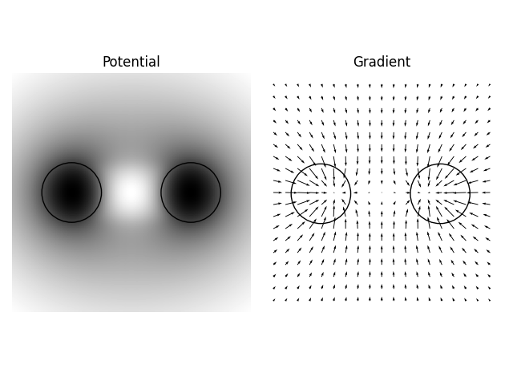

# Gravity

Simple program that calculates the gravitational field and potential from an object with cylindrical symmetry.

## Examples

For a cylinder, the force against distance profile is as predicted from analytical calculation, validating the results.

For a sphere, the force against distance profile is again as would be predicted. The potential is not symmetric (plotted is the potential along the x,  z and xz directions - they are slightly different). This is probably because the potential decays slower with distance than the force. At some distance, the potential/force from the discs that make up the sphere is approximated as the same as that of a point particle, but this approximation is less valid for the potential than for the force. Although they are not identical they are quite similar.

Results from a torus look reasonable. Interesting that, because the force along the surface does not point towards the center of the circle, as one travels from the inner to outer circumference of the torus, much of the trip would seem uphill.

## Algorithm

The potential and gravitational field is first calculated for a disc of uniform mass. This is done by uniformly distributing masses inside a circle and calculating the sum of their gravitational fields/potentials at all points of interest. This is an expensive calculation and so is only done once. The high fidelity reference potential and field produced is then used to calculate that of more complex objects by adding the scaled (and offset) potential/field of many discs. To make the torus, some of these discs have negative mass.

When a point on the reference potential is needed that was not initially calculated, its value is found by bilinear interpolation. If the point lies outside of the grid of points calculated for the reference potential, then the disc is treated as a point mass.

## Future

The definition of objects from discs is clunky and requires some geometry. It would be nice to easily form objects by reading image files of their cross-section, along with some parameters in a text file.

To get sphere to be perfectly symmetrical the reference potential is needed very far from the object. Currently, the grid must be uniformly sampled, and so the further the grid is sampled the less definition there is close to the object, where resolution is most important. So in future would be nicer to find multiple reference potentials at increasingly further distances. Bilinear interpolation can be done from the reference potential with the highest definition that contains the point. There is also no reason that the reference potentials need to be calculated every time instead of calculated once and then loaded from a file.
